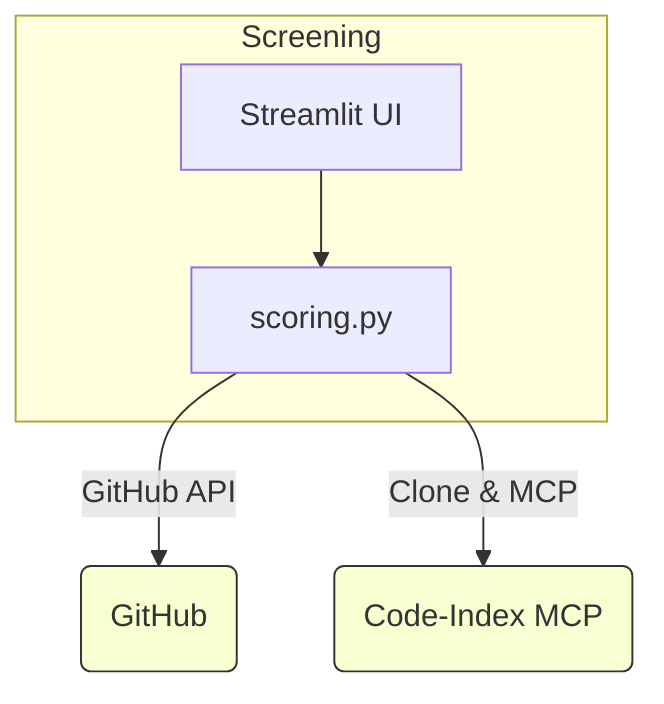

# AI Candidate Screener – Proof-of-Concept

> **72-hour build** – multi-agent ready, MCP-powered code insights, Streamlit UI.

---

## 🎯 What this repo does

1. **Load a job post** and HR constraints (years of exp, visa, # of slots).
2. **Ingest candidates** via JSON / CSV.
3. **Filter** by hard requirements.
4. **Score** each candidate on 3 axes:
   * Résumé keyword overlap
   * GitHub depth **& tech-stack match** (uses *Code-Index MCP* + README parsing)
   * LinkedIn placeholder (extensible)
5. **Surface insights** (languages, tools, tech-match %) in a Streamlit dashboard.
6. Designed to be the first stage in a **multi-agent interview pipeline** – the conversational agent can now ask follow-up questions based on gaps.


## 🗺️ Architecture



### Scoring pipeline

| Step | Module | Notes |
|------|--------|-------|
| 1 | `github_utils.fetch_github_profile` | repo & star counts, followers |
| 2 | `repo_indexer.fetch_and_analyse_github` | clones top 3 repos *(shallow)* |
| 3 | Code-Index MCP | quick index to count files & languages |
| 4 | README parser | scans README for **TECH_KEYWORDS** (Docker, React, etc.) |
| 5 | `scoring.tech_match_score` | compares detected tools vs JD keywords & categories for **skill-transfer** |
| 6 | Weighted blend | resume 60 %  · github 30 %  · linkedin 10 % |

Weights & keyword lists live in `src/scoring.py` and `src/repo_indexer.py` – tweak away.


## 🚀 Quick start

```bash
# 1. install deps (CPU-only, ~2 min)
pip install -r requirements.txt

# 2. run UI
streamlit run app.py
```

### Sample run
1. Sidebar ➜ **Load Sample Data**
2. Hit **Run Scoring & Shortlist**
3. Table shows languages & tools columns.  
   If a JD asks for *GraphQL* and tools column lacks it, a downstream agent can decide to "dig deeper".


## 🔍 Extending this POC

* **Deep dive scan** – in `repo_indexer` call `_index_project` recursively when a gap is found.
* **LinkedIn crawler** – plug Scrapfly/SerpAPI, feed into same tech-match.
* **LLM interview agent** – use LangChain, pass `tech_match` to focus questions.
* **Deploy** – Streamlit Cloud or HF Spaces (fits free tier).

---

© 2025 – weekend hacking project. MIT License. 